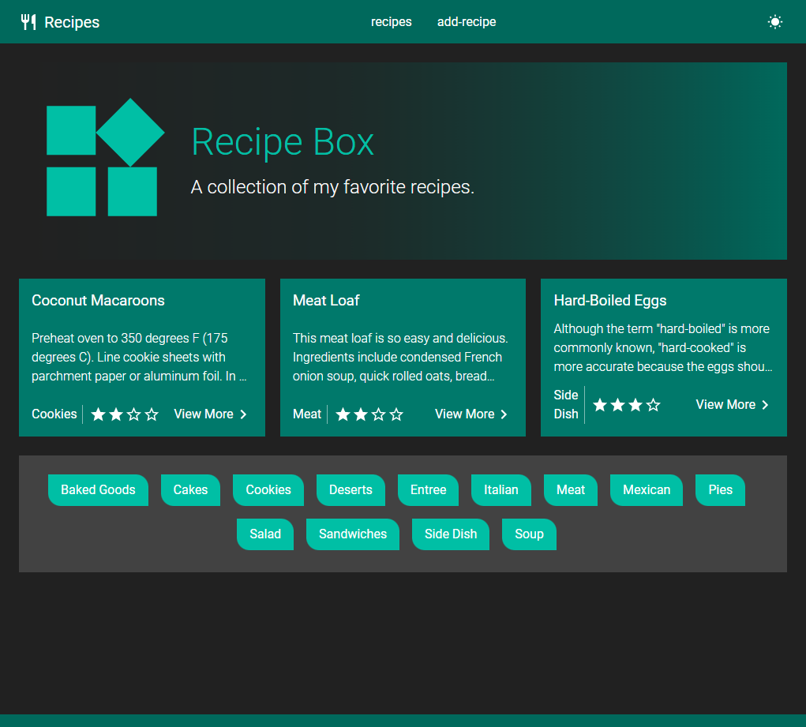

# Recipe App

Store and share recipes.

* Light and Dark Theme with Material Colors
* Context API
* Styled Components
* Typescript
* node / express backend in seperate repo

## Run locally
* add .env file

```
#development
REACT_APP_BASEURL
REACT_APP_RECIPE_ENDPOINT
```

## GH Pages Resource
* https://create-react-app.dev/docs/deployment/#building-for-relative-paths

